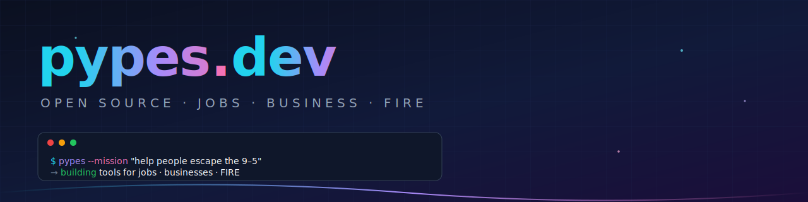
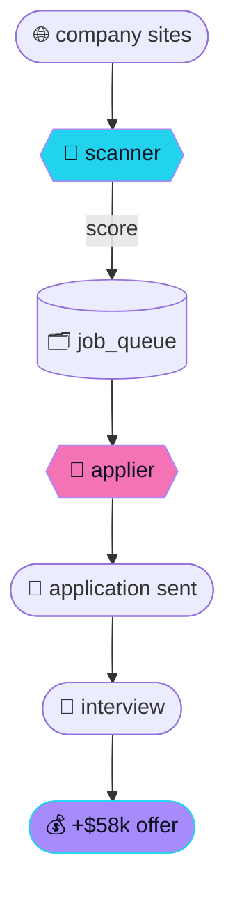

<div align="center">

<a href="https://gethiringfunnel.com">
  
</a>

<br/>

<a href="https://gethiringfunnel.com"></a>
<a href="mailto:jared@pypes.dev"></a>
<a href="https://github.com/pypesdev?tab=repositories"></a>

<br/><br/>

<picture>
  <source media="(prefers-color-scheme: dark)"
          srcset="https://readme-typing-svg.demolab.com?font=JetBrains+Mono&weight=700&size=26&duration=2800&pause=900&color=22D3EE&center=true&vCenter=true&width=720&lines=find+jobs.;start+businesses.;achieve+FIRE.;ship+open+source+that+actually+works." />
  
</picture>

</div>

---

## ▎ what is this place

```ts
const pypes = {
  mission: "help people escape the 9–5",
  tools: ["find jobs", "start businesses", "achieve FIRE"],
  license: "MIT, mostly",
  vibes: "ship > talk",
} as const;
```

We write open-source software so the path to financial independence stops being a secret club. **No paywalls on the things that matter. No SaaS rent on the building blocks of your life.**

---

## ▎ active venture — HiringFunnel

<table>
<tr>
<td width="60%" valign="top">

> ### Land a $200k+ engineering job in 90 days.

A career-coaching platform with an autonomous job-search pipeline bolted to a senior engineer who has your back.

- ⚡ **Scanner** — discovers roles every 8h, scores them with Claude
- 🤖 **Applier** — claims matches every 30m, fills forms via headless browser, submits
- 🧭 **Coaching** — resume, interview prep, offer negotiation, 1-on-1

Clients average a **`+$58k`** salary jump.

<a href="https://gethiringfunnel.com"></a>
<a href="https://app.gethiringfunnel.com"></a>

</td>
<td width="40%" valign="top">



</td>
</tr>
</table>

---

## ▎ popular repos

### 🧭 find jobs

| repo | what it does | lang |
|---|---|---|
| **[foxyapply](https://github.com/pypesdev/foxyapply)** ⭐3 · 🍴2 | Stop copy-pasting answers into 50 LinkedIn Easy Apply forms. Real browser fills + submits while you do literally anything else. | `TypeScript` |
| **[jobs](https://github.com/pypesdev/jobs)** | Job application bot. | `Python` |
| **[resume-template](https://github.com/pypesdev/resume-template)** | Clean, opinionated resume site you can ship in an afternoon. | `JavaScript` |
| **[3dportfolio-template](https://github.com/pypesdev/3dportfolio-template)** | 3D portfolio starter for engineers who want to flex a little. | `JavaScript` |
| **[senior-fe-interview-prompt](https://github.com/pypesdev/senior-fe-interview-prompt)** | Battle-tested prompt set for senior frontend interviews. | `TypeScript` |

### 🚀 start businesses

| repo | what it does | lang |
|---|---|---|
| **[coldflow](https://github.com/pypesdev/coldflow)** ⭐8 · 🍴2 | Open-source cold email that actually works. Stop paying enterprise prices — transparent, functional, accessible. | `TypeScript` |
| **[dmarc-doctor](https://github.com/pypesdev/dmarc-doctor)** | `npx dmarc-doctor yourdomain.com` — diagnose SPF, DKIM, and DMARC in one command. Zero deps, CI-friendly. | `TypeScript` |
| **[smtp-warmer](https://github.com/pypesdev/smtp-warmer)** | `npx smtp-warmer test --host ... --port ... --user ...` — 30-second self-hosted SMTP self-test: TLS, AUTH+RCPT sandbox, DNSBL, FCrDNS. Zero deps. | `TypeScript` |
| **[inbox-warmer](https://github.com/pypesdev/inbox-warmer)** | Self-hosted inbox warm-up for cold-email senders. BYO seed pool — domains exchange real-looking emails to build sender reputation before your first cold campaign. | `TypeScript` |
| **[250-google-leads-in-30-seconds](https://github.com/pypesdev/250-google-leads-in-30-seconds)** ⭐1 | n8n workflow scrapes Google Maps → Notion. ~250 leads in ~30 seconds. | `n8n` |
| **[agents](https://github.com/pypesdev/agents)** | Fast, lightweight tool for spinning up autonomous AI agents. | `Rust` |
| **[meta-daily-adspend-update-sheet-n8n-workflow](https://github.com/pypesdev/meta-daily-adspend-update-sheet-n8n-workflow)** | Daily adspend / impressions / clicks from Meta Marketing API → Google Sheets. | `n8n` |

---

<div align="center">

### `// pypesdev was here`

<sub>built in public · powered by caffeine and compounding interest</sub>

<br/>

<a href="https://github.com/pypesdev?tab=followers"></a>
<a href="https://github.com/pypesdev/coldflow"></a>
<a href="https://github.com/pypesdev/foxyapply"></a>

</div>
